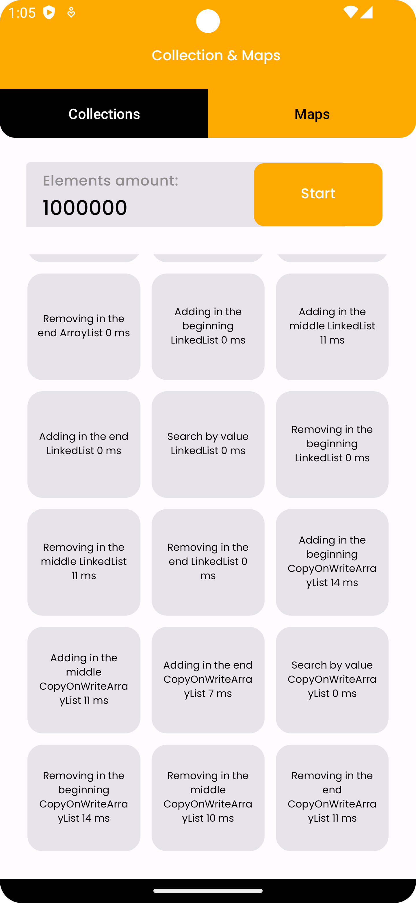

Hi, my name is Andrii, and welcome to the Benchmarks project!

## What I used in this project:

- Java, Kotlin
- Android Framework
- RecyclerView, TabLayout
- ViewBinding
- LiveData
- RxJava, RxAndroid
- Kotlin Flow
- ComposeView
- DialogFragment + ResultAPI
- Dagger 2 DI
- Clean architecture
- JUnit
- Espresso

The task was: "Create an application running various operations on Collections and Maps, calculate and display the average execution time of these operations (time in milliseconds)"
## Project overview:

When you first open the app, you'll see a dialog window with the input field, the user should enter the size of the collection:

We have limits for this size: from 1_000_000 to 10_000_000 elements. If the user enter the wrong size, the error shows:

If the size is correct and the user clicks on the button "Calculate", the dialog screen is hidden and calculations begin. They work asynchronously for each cell, and the user can see results ASAP.

When all cells are done, the user can start calculations again(with the same size) or click on the field with the entered size to open the dialog and change the size

It's similar works for Maps.

This project had several stages:

- Created app using Java and XML Views
- Created Unit tests and UI tests
- Migrated main components from Java to Kotlin
- Migration to Compose. Implemented ComposeView into this project

Thank you for your interest in my project. Feel free to explore the code and project structure. If you have any questions or suggestions, please don't hesitate to reach out!

My contacts:

[LinkedIn](https://www.linkedin.com/in/andrii-seleznov-32142721a/)

[Email](https://mail.google.com/mail/?view=cm&to=seleznov.andriy@gmail.com) 
